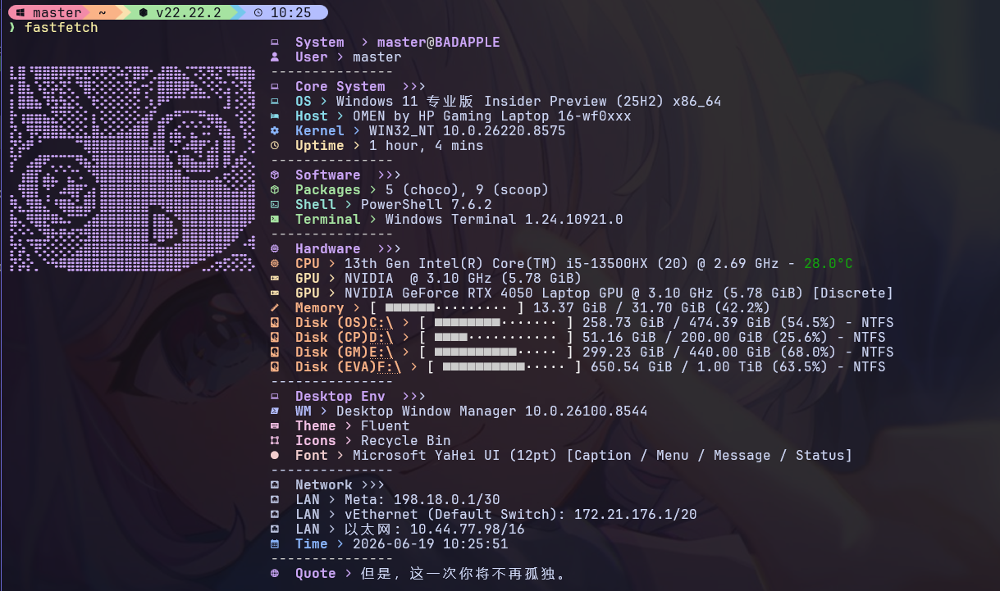
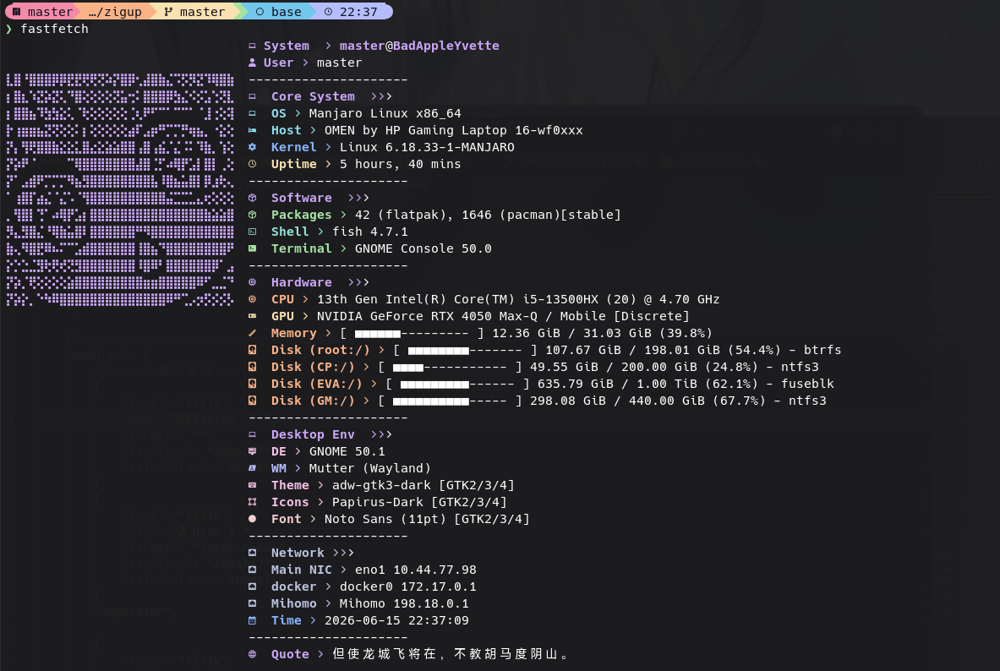

<div align="center">
  
  
  
</div>

# 🐱 fastfetch-mocha

A **Catppuccin Mocha** themed [fastfetch](https://github.com/fastfetch-cli/fastfetch) configuration, crafted for both **Windows** and **Linux**.

一套 **Catppuccin Mocha** 主题的 [fastfetch](https://github.com/fastfetch-cli/fastfetch) 配置方案，支持 **Windows** 和 **Linux** 双平台。

> ✨ 由 [YuNaitang](https://github.com/YuNaitang) 制作并维护

---

## 📸 Preview / 预览

### Windows




### Linux



The Linux output is similar — featuring identical styling and color scheme, with platform-appropriate adaptations.

Linux 输出效果类似 — 采用相同的样式和配色方案，并针对平台做了适配。

---

## 🚀 Usage / 使用

### Windows

1. **安装 fastfetch**

   ```powershell
   winget install fastfetch
   # or
   scoop install fastfetch
   ```

2. **Clone or copy config / 克隆或复制配置**

   ```powershell
   git clone https://github.com/YuNaitang/fastfetch-mocha.git
   mkdir -Force ~\.config\fastfetch
   copy .\windows-cmd\* ~\.config\fastfetch\
   ```

3. **Run / 运行**

   ```powershell
   fastfetch
   ```

### Linux (Bash)

1. **安装 fastfetch**

   ```bash
   # Check https://github.com/fastfetch-cli/fastfetch for install options
   # 请参考官方仓库了解安装方式
   ```

2. **Clone or copy config / 克隆或复制配置**

   ```bash
   git clone https://github.com/YuNaitang/fastfetch-mocha.git
   mkdir -p ~/.config/fastfetch
   cp ./fastfetch-mocha/linux-bash/* ~/.config/fastfetch/
   ```

3. **Run / 运行**

   ```bash
   fastfetch
   ```

---

## 📁 Directory Structure / 目录结构

```
fastfetch-mocha/
├── docs/                # Documentation / 文档
│   └── screenshots/     # 📸 Screenshots / 截图
├── linux-bash/          # Linux (Bash) configuration / Linux (Bash) 配置
│   ├── config.jsonc     # Main config / 主配置文件
│   └── logo             # ASCII art logo / ASCII 艺术 Logo
├── windows-cmd/         # Windows (CMD) configuration / Windows (CMD) 配置
│   ├── config.jsonc     # Main config / 主配置文件
│   └── logo             # ASCII art logo / ASCII 艺术 Logo
├── logo/                # Standalone logo copy / 独立 Logo 副本
│   └── 1                # Logo file / Logo 文件
├── .gitignore           # Git ignore rules / Git 忽略规则
└── README.md            # This file / 本文件
```

---

## 🎨 Theme Colors / 配色方案 (Catppuccin Mocha)

| Role / 角色  | Used For / 用途       | Hex       |
|-------------|----------------------|-----------|
| Mauve       | Title, Logo / 标题, Logo | `#cba6f7` |
| Teal        | OS                   | `#89dceb` |
| Blue        | Kernel, Time / 内核, 时间 | `#89b4fa` |
| Yellow      | Uptime, GPU          | `#f9e2af` |
| Green       | Packages, Terminal / 包, 终端 | `#a6e3a1` |
| Peach       | CPU, Memory, Disk    | `#fab387` |
| Pink        | DE, Theme, Icons, Font | `#f5c2e7` |
| Lavender    | WM                   | `#b4befe` |
| Subtext1    | Value output / 值输出  | `#cdd6f4` |
| Red         | Font (alt) / 字体(备选) | `#f2cdcd` |

---

## 📋 Features / 功能特性

- **Catppuccin Mocha** color scheme throughout / 贯穿始终的 Catppuccin Mocha 配色
- **Custom ASCII logo** with mauve accent / 自定义 ASCII Logo（紫罗兰色调）
- **Progress bars** for CPU, memory, disk usage / CPU、内存、磁盘进度条
- **Multi-NIC display** — physical, virtual, VPN all shown / 多网卡显示
- **One-liner quote** from [Hitokoto](https://hitokoto.cn/) with local cache / 一言随机句子（带本地缓存）
- **Nerd Font icons** for visual clarity / Nerd Font 图标提升视觉效果

### Platform Differences / 平台差异

| Aspect / 方面 | Windows (`windows-cmd/`) | Linux (`linux-bash/`) |
|--------------|------------------------|----------------------|
| Value color field / 值颜色字段 | `outputColor` | `valueColor` |
| Progress bar fill / 进度条填充 | `■` (elapsed) / `·` (total) | `-` (fill) / `·` (empty) |
| CPU temperature / CPU 温度 | `temp: true` | `showTemperature: true` |
| Network / 网络 | Built-in `localip` module / 内置模块 | Shell `command` |
| Time / 时间 | Built-in `datetime` module / 内置模块 | Shell `date` command |
| Quote / 一言 | `curl.exe` + `%TEMP%` | `curl` + `~/.cache` |
| Color thresholds / 色阈值 | `green: 30, yellow: 70` | `green: 30, yellow: 70` |

---

## ⚙️ Requirements / 依赖

- [fastfetch](https://github.com/fastfetch-cli/fastfetch) **2.64+**
- A [Nerd Font](https://www.nerdfonts.com/) (e.g. JetBrainsMono Nerd Font) / 一款 Nerd Font（如 JetBrainsMono Nerd Font）
- **Windows 10/11** (for Windows config / Windows 配置)
- **Linux Bash** (for Linux config / Linux 配置)

---

## 📄 License / 许可证

MIT © [YuNaitang](https://github.com/YuNaitang)
